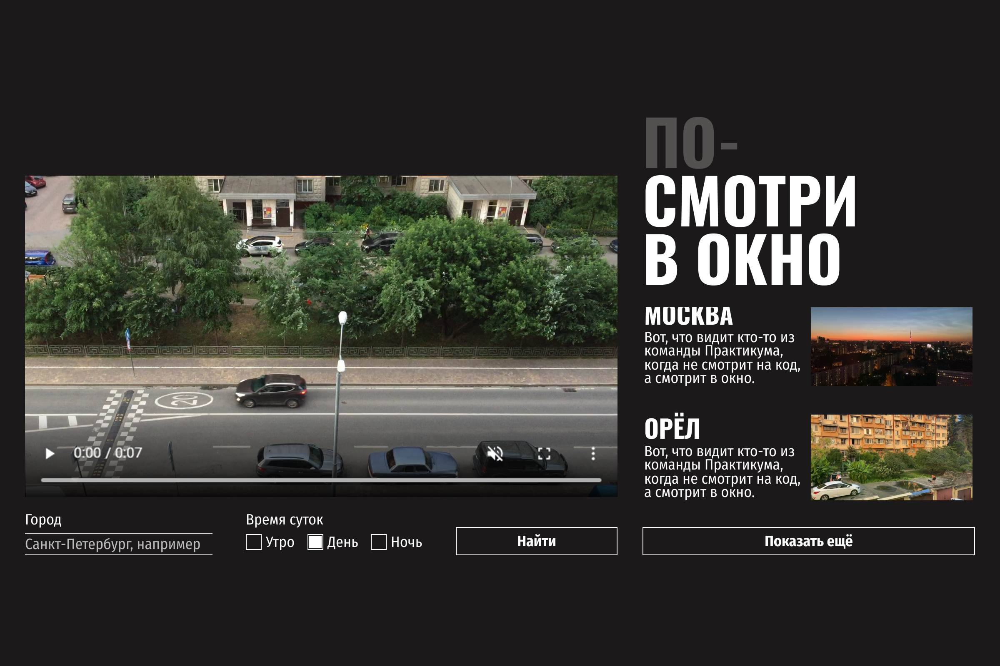
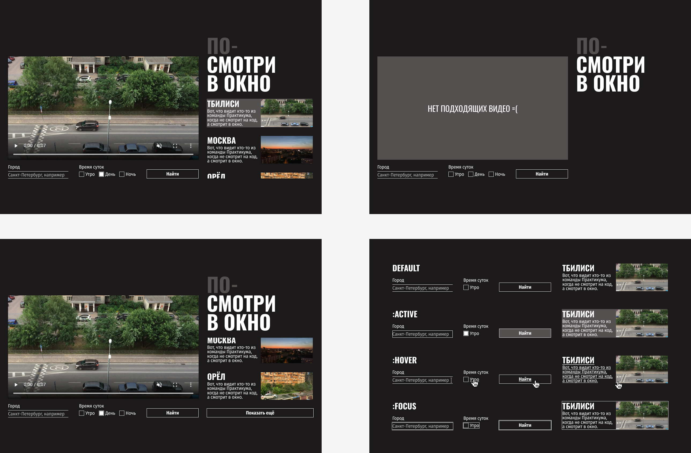

# Проектаня работа «Посмотри в окно» 
## Это веб-приложение позволяет пользователю просматривать видеозаписи различных городов в разное время суток.
### В данной работе прорабатывается теоретический блок HTML и CSS, включающий в себя следующие основные темы:

+ Video, iframe, API
+ Псевдоклассы и псевдоэлементы 
+ Доступность, ARIA, древо доступности
+ Скролл, его удаление и отображение 

